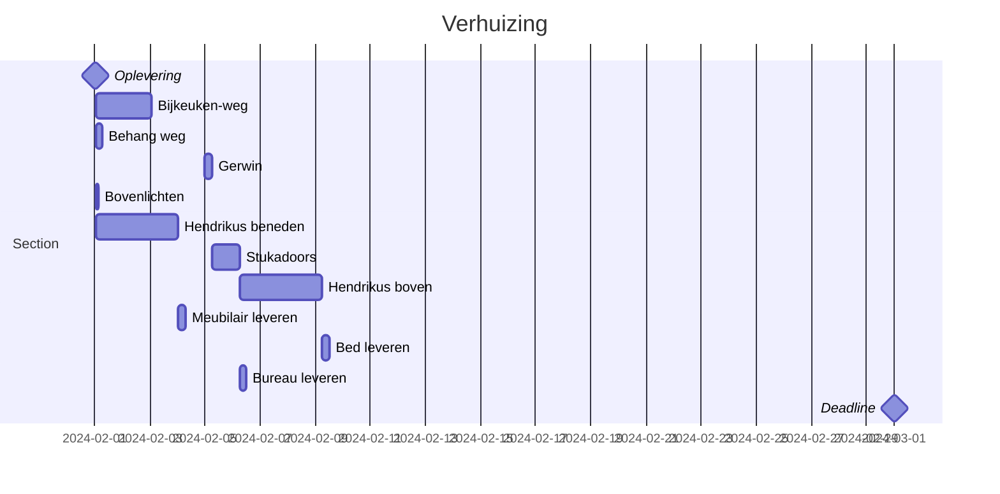

# Planning

## Toelichting

### Gerwin

- Stopcontacten verlagen op de slaapkamers
- Bijkeuken leidingen en afvoer afdoppen onder de grond
- Netwerkbekabeling trekken onder grond van de meterkast naar de bijkeuken. Netwerkkabel[^netwerkkabel] nodig

### Kunststof bovenlichten

De bovenlichten[^bovenlicht] vervangen door ondoorzichtige platen

### Hendrikus

- Verven trap
- Verven muren huiskamer

### PVC-leggers

Komen PVC[^pvc] leggen wanneer de vloer in de bijkeuken goed is

### Stukadoors

- Slaapkamer, volledig (Die met balkon)
- Andere slaapkamers: Alleen gefreesde stukken verlaagd stopcontacten
- Bijkeuken

### Hendrikus boven

- Slaapkamers, alles wat gestuct is
- Verven deurposten boven

### Todo

- Bellen PVC-vloer, vragen of ze kunnen leggen
- Appen stukadoors

[^netwerkkabel]: Een netwerkkabel kopen, CAT7 als het even kan
[^pvc]: PVC kopen bij Bijl ter Apel, Wilfred heeft factuur gestuurd zonder details
[^bovenlicht]: Bestellen bij [Kunststofplatenshop](https://kunststofplatenshop.nl/bovenlicht-dichtmaken-met-kunststof/). Bijvoorbeeld met [plexiglas](https://perlaplast-kunststofshop.nl/plexiglas?kleur=73). Tutorial voor vervangen is [hier](https://www.youtube.com/watch?v=5xnP7Lu5nhg)
